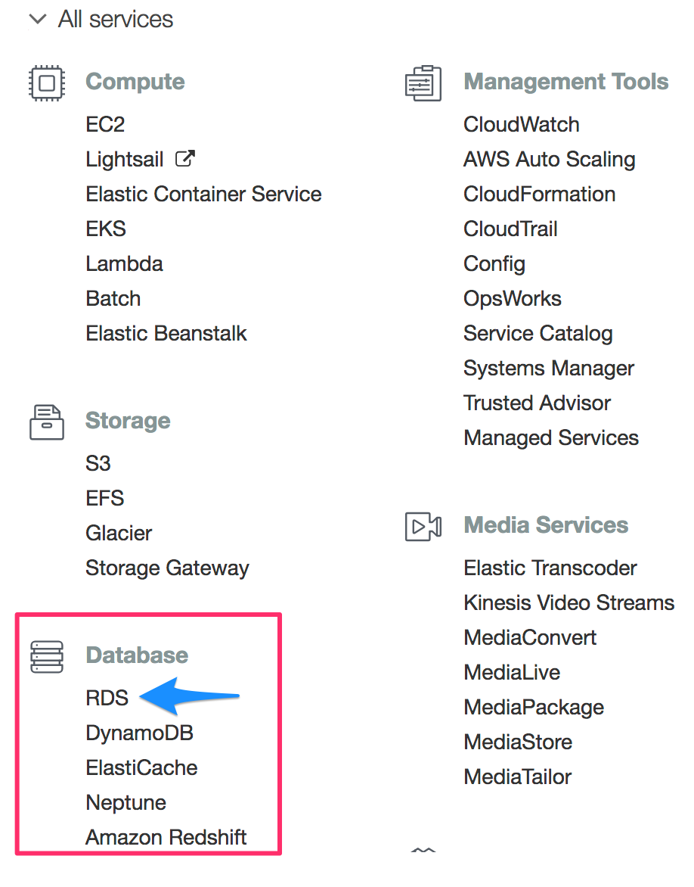

# Creating a PostgreSQL Database in AWS RDS

* Start by logging in to the AWS Management Console, then navigate to the **RDS** section under **Database**.

 

* Click **Create database** from the **Create database** section to the right. This button will take you to the **Engine options** page, which brings up a menu of different relational databases.

* **Note:** AWS may have a different screen than the one pictured below. If this is the first time using the service, the orange **Create database** will still be on the right.

 

 **Note:** There may be an option to create a database with Amazon Aurora, which is a paid database. We will not be using this in today's lesson.

* Make sure the **Standard create** option is checked in the first box.

 

* Select **PostgreSQL** and keep the default version option. **Note** that the version may be different from what is pictured.

 

* **IMPORTANT:** Under **Templates**, select **Free Tier**.

 

* Fill out the fields under **Settings**. Use **myPostgresDB** as the database instance identifier and **root** as the master username.

 **Note**: We recommend sticking to these names today for consistency, but the database instance identifier and master username can take any name in the future.

* Uncheck the **Auto generate password** box. Enter a password and be sure to record it somewhere. The other settings will be accessible in the future, but the password will not.

 

* Leave the settings for **DB instance class** as the default values.

* Under the **Storage** box, uncheck the box next to **Enable storage autoscaling** and leave the rest of the options as the default values.

 

* Under **Connectivity**, select **Yes** under the **Public accessibility** option. Explain that this does not mean that everyone can access the database, as a password is still required, but it allows connections from outside sources like pgAdmin. Leave the rest of the options as the default values.

 

* Under **Additional configuration**, click the down arrow and make the database name **my_data_class_db** (use this name for the sake of consistency. In the future, any name can be used). Then, uncheck the boxes next to **Enable automatic backups**, **Enable Performance Insights**, and **Enable auto minor version upgrade**. Leave the rest of the settings as the default values.

 

 

* Click **Create Database** followed by **View DB Instance details** to navigate to the instance console page. The database creation on AWS's end will take anywhere from 10 to 15 minutes.
