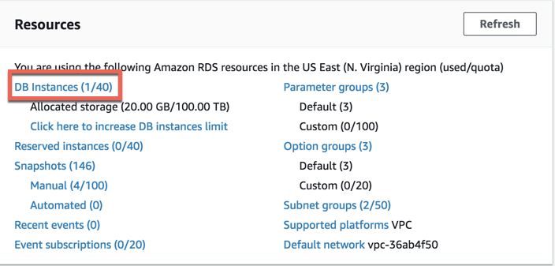
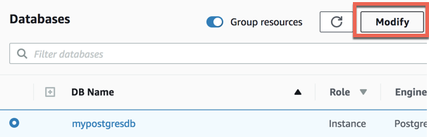
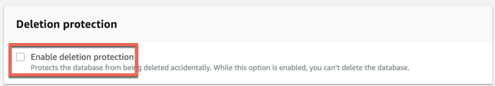
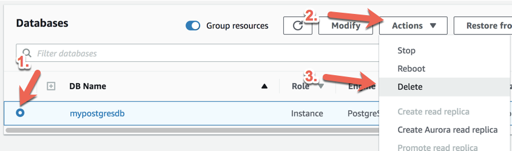
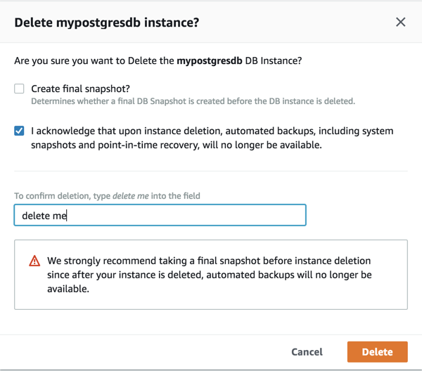
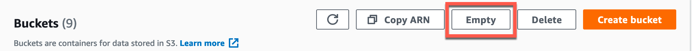

# AWS Cleanup guide

* To delete the RDS database, follow these steps:

* Log in to the AWS management console and navigate to the **RDS** dashboard. Click **DB Instances**.

  

* Select **DB Name** and click **Modify**.

  

* Scroll down to **Deletion protection** and uncheck the box next to **Enable deletion protection**. If the box is already unchecked, you can navigate back to the instance page and continue.

* If the box needs to be unchecked, click **Continue**, select **Apply immediately**, then **Modify DB Instance**.

  

* Next, on the database dashboard, make sure the database is checked, and then click **Actions** followed by **Delete**.

  

* **Important:** Uncheck **Create final snapshot?**, then check the acknowledgement box. Type **delete me** and click **Delete**. If you do not uncheck this box, your databases will create a backup that could accrue additional costs, so be sure not to skip over this step.

  

* This will take a few minutes to fully delete.

* To delete any S3 buckets, navigate to the S3 dashboard and follow these steps:

 * **Note:** This process will delete the whole bucket and all its contents. For the sake of time, this will be the process. Mention to students that individual files inside a bucket might be deleted as well.

 * Check the box next to the bucket you want to delete, then click **Empty**.

 

 * Enter **permanently delete** into the text box, and then click **Empty**.

 * Once the previous step is complete, click **Exit** exit on the next screen

 * With the bucket still selected, click **Delete**.

 * On the next screen, enter the bucket name in the input field and then click **Delete bucket**.

 * The bucket and all of its files are now deleted.
