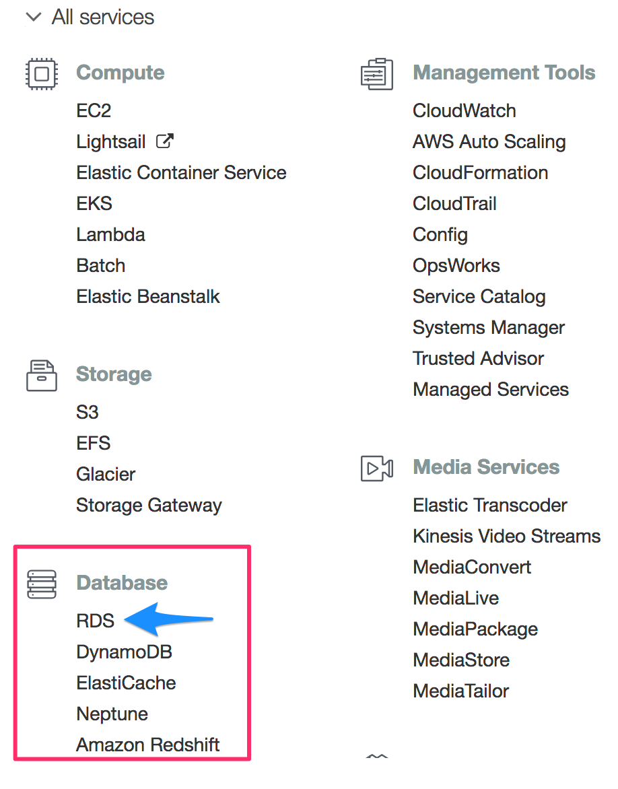
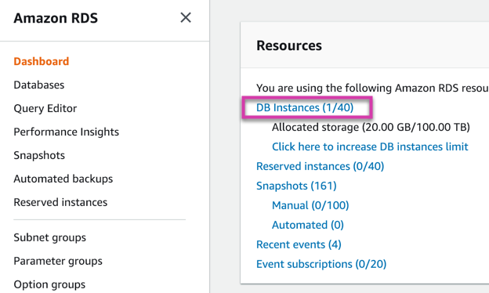
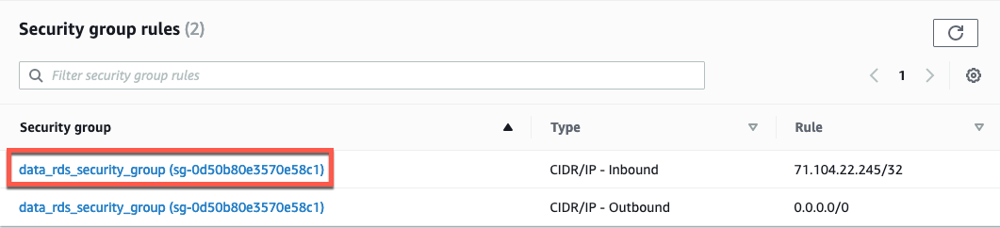
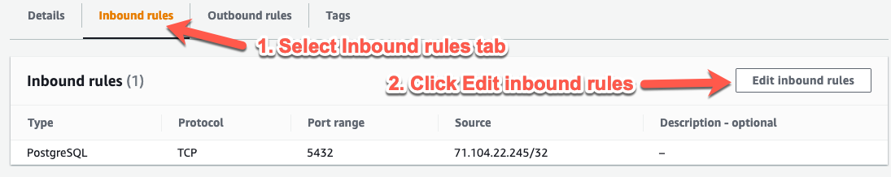
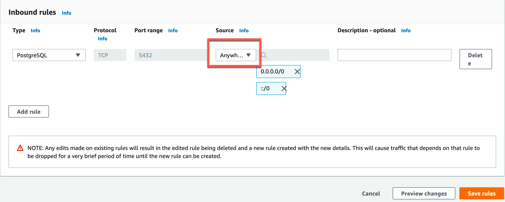
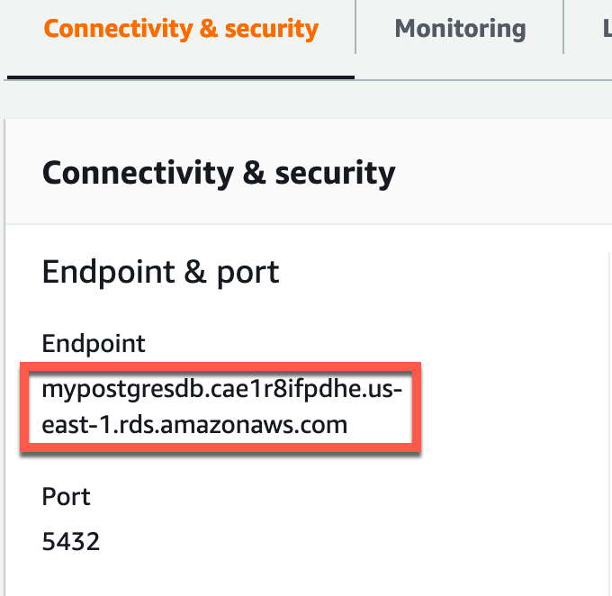
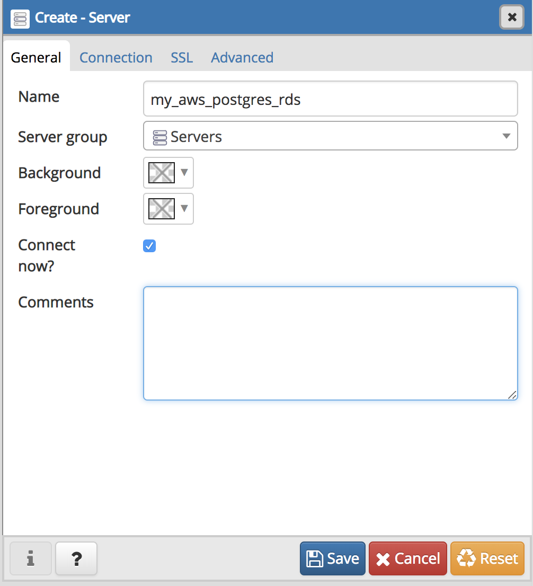
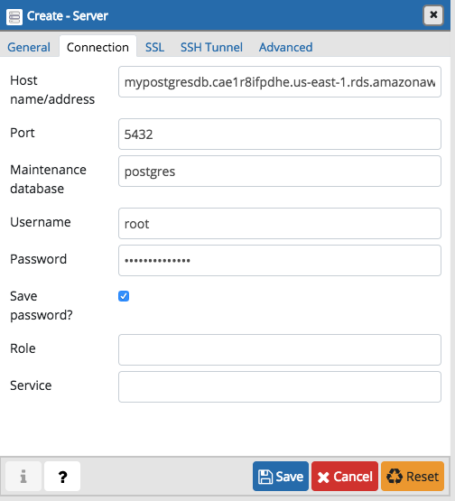

# RDS, PostgreSQL, and pgAdmin

* Open the pgAdmin UI.

* Log in to the AWS console and navigate to **RDS** under **Database**.

 

* Navigate to **Instances** in the **Resources** section.

 

* Go to the database created earlier, `mypostgresdb`.

* Navigate to the **Security group rules** section on the right.

* Click the security group for type **CIDR/IP - Inbound**.

 

* This will navigate to a new page. Follow these steps to give the database access to all inbound traffic:

 * From the management console, navigate to the **Inbound rules** tab on the bottom part of the screen, and then click **Edit inbound rules**. This will bring up a menu to set rules for the security group.

   

 * Change the Source to **Anywhere** and click **Save rules**. The RDS instance will now accept a connection from anywhere. This isn't completely open to the world because the endpoint, username, and password are still needed to connect.

     

* Navigate back to the instance console and find your endpoint in the **Connectivity & security** tab.

 )

* Open pgAdmin, right-click on **Servers**, and then go to **Create - Server**. Then, take the following steps to create a connection to the AWS RDS instance.

* Under the **General** tab, enter the server name as **my_aws_postgres_rds**.

 

* Under the **Connection** tab, do the following:

 * Enter the endpoint in the **Hostname/address** field. This is unique to the instance.

 * Enter `postgres` in the **Maintenance** database field. This is the default for all Postgres RDS instances.

 * Enter the username in the **Username** field: in this case, `root`.

 * Enter the password that was created for your RDS instance.

 * Check the box next to **Save password**.

* Click **Save**. If all information is entered correctly, this will set up the connection and not return an error.

   .
