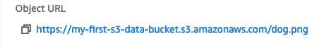

# Cloud Storage on S3

* Go to **console.aws.amazon.com** and select **S3** under **Storage**.

* Click **Create bucket**.

* Create a bucket name and choose the region.

* **Note:** The bucket name must be unique across all existing bucket names in Amazon S3. Buckets cannot be renamed or created inside of another bucket.

* Leave the region as the default&mdash;
for example, `US East (N. Virginia)`. Changing the region will change the object URL used in all examples today.

* Under **Block Public Access setting for this bucket**, uncheck the **Block all public access** option and check the box to acknowledge the change.

* Multiple [security breaches](https://securityboulevard.com/2018/01/leaky-buckets-10-worst-amazon-s3-breaches/) have been caused by unsecured S3 buckets.

* Public access is denied by default; for our ease of use, we will allow public access, but for production-ready storage, it's best to limit access to an as-needed basis TODO: link to privileges.

* The rest of the options can be left as the default values.

* **Tags** are user-defined key-value pairs of information that can help keep track of buckets.

* Scroll to the bottom and click **Create bucket**.

* You will be redirected to the main S3 page; click on the bucket you just created.

* We'll now upload an image file to the newly created bucket. Click the bucket name, then click **Upload**. This will direct you to a new page where you can add files or folders to your bucket.

 * Click the **Add files** box, which will allow you to upload local files.

 * Optionally, you can drag in files.

 * Once the files have been added, scroll down and click **Upload**.

 * After the upload succeeds, click **CLOSE**.

* You will now see your file in the bucket; however, even though we allowed public access to the bucket, the default permission setting for each new file is to deny access to everyone, so it needs to be changed.

* Select the box next to the file, then click **Actions** and select **Make public**.

* From the next screen, click **Make public**.

* Then, click close on the new screen.

* Your file will now be publicly available. To confirm, click on the file to open the **Object overview** page.

* To confirm, click the **Object URL**. If everything is correct, you will be able to download the file.

* You will now be able to publicly access your file!

* **Note:** You will always have the ability to remove public access.
