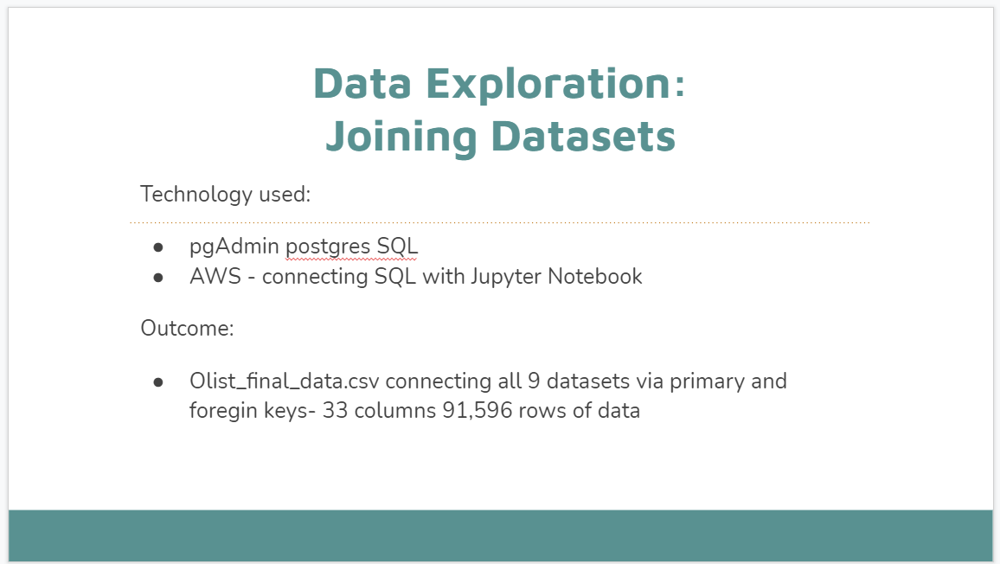

## Dashboard

Link to Storyboard on Google Slides:
https://docs.google.com/presentation/d/1_N_j0d4CG4-RKPjfpELFG0YeHFaeBoBZTHp2gu3JuAQ/edit?usp=sharing

This week our team worked hard in getting Database connected and Machine Learning models getting close to a good percentage. For the Dashboard and story we began working on our Google slides and figuring out how our presentation would flow. We've decided on working with Google slides and Tableau for the presentation, tell our story in Google slides and show our visualizations via Tableau. Since a couple of us would be working on Tableau it was easiest to open a free trial Tableau account so we can all have access to it. 

Our preliminary slides show how we came about the topic of eCommerce Business Trends, where we gathered our data from and topics of exploration.

For the Database portions or our slides we want to connect to Jupyter Notebook and show our connections to AWS, postgresSQL, our database connectivity. 

Description of Tools Used to Create Final Dashboard:

Description of Interactive Elements:
