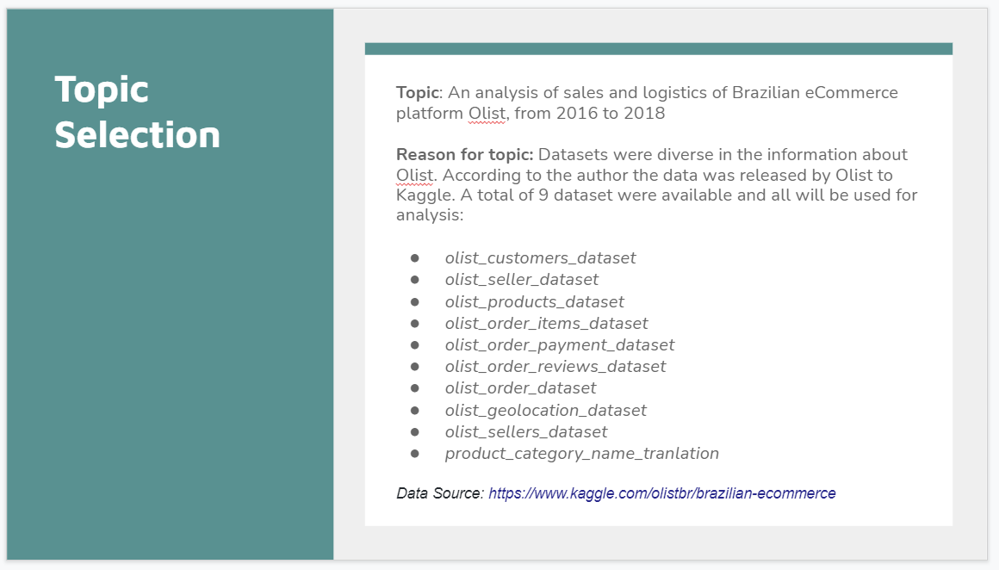

## Dashboard

Link to Storyboard on Google Slides:
https://docs.google.com/presentation/d/1_N_j0d4CG4-RKPjfpELFG0YeHFaeBoBZTHp2gu3JuAQ/edit?usp=sharing

This week our team worked hard in getting Database connected and Machine Learning models getting close to a good percentage. For the Dashboard and story we began working on our Google slides and figuring out how our presentation would flow. We've decided on working with Google slides and Tableau for the presentation, tell our story in Google slides and show our visualizations via Tableau. Since a couple of us would be working on Tableau it was easiest to open a free trial Tableau account so we can all have access to it. 

Our preliminary slides show how we came about the topic of eCommerce Business Trends, where we gathered our data from and topics of exploration.

For the Database portions or our slides we want to connect to Jupyter Notebook and show our connections to AWS, postgresSQL, our database connectivity. 

For machine learning we intend to try to import the data via AWS in order to run the machine learning models. We will be choosing the models that provided the better results. 

Storyboarding our dashboard, we've decided to speak a little about Olist and there numbers in 2016-2018, if their was a rise in sellers, was their any fluctuation to sale of products, and what were customers saying about their shopping experience. We hope to show that with line graphs that can togle between years. Maps with customer reviews in the pop ups from the cities they come from. Review if seller accounts have increase over the 3 year time span presented. And another dashboard for logistics, it's part of the service they offer and we want to review further see how it impact the buying and selling experience. 

We've created a Tableau online account on the free trial and hope to complete the presentation within the free trial time. We've included a link in our slides. Looking forward we hope to solidify our data to be able to create this visualizations. 
