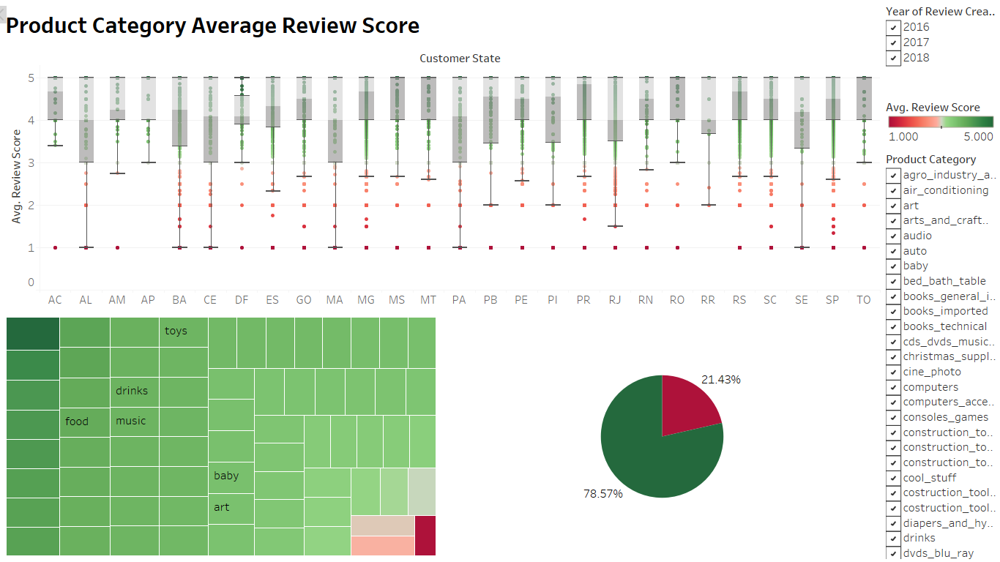

# eCommerce Business Trends

### Group Members

Corinne Hume - Branches: [Corinne](https://github.com/cmhume/eCommerce_Business_Trends/tree/Corinne), [visuals_wk2](https://github.com/cmhume/eCommerce_Business_Trends/tree/visuals_wk2), [readme_wk2](https://github.com/cmhume/eCommerce_Business_Trends/edit/readme_wk2), [readme_wk3](https://github.com/cmhume/eCommerce_Business_Trends/tree/readme_wk3), [presentation_wk3](https://github.com/cmhume/eCommerce_Business_Trends/tree/presentation_wk3), [presentation_notes_Corinne](https://github.com/cmhume/eCommerce_Business_Trends/blob/presentation_notes/Presentation/presentation_notes_Corinne.md), [readme_wk4](https://github.com/cmhume/eCommerce_Business_Trends/tree/readme_wk4)

Elaine Ng - Branches: [Elaine](https://github.com/cmhume/eCommerce_Business_Trends/tree/Elaine), [technology.md](https://github.com/cmhume/eCommerce_Business_Trends/tree/technology.md), [Machine_Learning](https://github.com/cmhume/eCommerce_Business_Trends/tree/Machine_Learning), [readme_wk2](https://github.com/cmhume/eCommerce_Business_Trends/blob/readme_wk3/README.md), [readme_wk3](https://github.com/cmhume/eCommerce_Business_Trends/tree/readme_wk3), [.gitignore](https://github.com/cmhume/eCommerce_Business_Trends/blob/readme_wk3/.gitignore), [requirements.txt](https://github.com/cmhume/eCommerce_Business_Trends/blob/readme_wk3/requirements.txt), [presentation_notes_Elaine](https://github.com/cmhume/eCommerce_Business_Trends/blob/presentation_notes/Presentation/presentation_notes_Elaine.md), [readme_wk4](https://github.com/cmhume/eCommerce_Business_Trends/tree/readme_wk4)

Luz Maria Cabral - Branches: [Luz](https://github.com/cmhume/eCommerce_Business_Trends/tree/Luz), [readme_wk2](https://github.com/cmhume/eCommerce_Business_Trends/blob/dbb9a857e30dd3be375ff0cc25c391f09c8242df/Dashboard_Luz.md), [readme_wk3](https://github.com/cmhume/eCommerce_Business_Trends/blob/readme_wk3/Luz_dashboard_readme_wk3), [presentation_notes_Luz](https://github.com/cmhume/eCommerce_Business_Trends/blob/presentation_notes/Presentation/presentation_notes_Luz.md), [readme_wk4](https://github.com/cmhume/eCommerce_Business_Trends/tree/readme_wk4)

Manupriya Sharma - Branches: [Manupriya](https://github.com/cmhume/eCommerce_Business_Trends/tree/Manupriya), [Database](https://github.com/cmhume/eCommerce_Business_Trends/tree/Database), [readme_wk2](https://github.com/cmhume/eCommerce_Business_Trends/blob/dbb9a857e30dd3be375ff0cc25c391f09c8242df/Database_Manupriya.md), [readme_wk3](https://github.com/cmhume/eCommerce_Business_Trends/blob/readme_wk3/Manupriya_ML_readme_wk3), [presentation_notes_Manupriya](https://github.com/cmhume/eCommerce_Business_Trends/blob/presentation_notes/Presentation/presentation_notes_Manupriya.md), [readme_wk4](https://github.com/cmhume/eCommerce_Business_Trends/tree/readme_wk4)

## Presentation

**Speaker notes from presentation are in the "Presentation" folder**

Link to [Google Slides](https://docs.google.com/presentation/d/123g32q7Y1Ol1Q0KDGNYB0UI2wL3trsAx_ia_VTf3Q0E/edit?usp=sharing)

### Project 

**Selected Topic:** Brazilian eCommerce Business Trends

In this project, we will analyze customer orders placed between 2016-2018 from sellers on the Brazilian eCommerce platform [Olist Store](https://olist.com/).  From this data, we will first determine the number of customers by geographic region (looking at zip code prefix, city, and state), most popular products, number of repeat customers and purchases, and total purchases by date. After data cleaning and initial analysis, we will use machine learning to make predictions on customer behavior, providing sellers on Olist the opportunity to increase sales and customer base.

**Description of our source of data:**

We chose the [Brazilian-eCommerce](https://www.kaggle.com/olistbr/brazilian-ecommerce) dataset from Kaggle for our analysis.  This dataset contains approximately 100,000 customer orders, along with corresponding files on product information and English translations of product categories originally in Portuguese. Seller names in this dataset were anonymized and replaced with Game of Thrones House names.  Six files from the original Kaggle dataset were chosen for further analysis: geolocation dataset, olist_customers_dataset, olist_product_dataset, order_item_dataset, olist_orders_dataset, and product_category_name_translation. 

*_Data Source: https://www.kaggle.com/olistbr/brazilian-ecommerce_*

**Questions we hope to answer with our data:**

With this data, we hope to answer...
- What are business trends like for Olist, in general?
- What data features impact review scores the most?
- Can we predict review scores using machine learning?

## Database

We used Postgres to create tables in SQL. The ERD below shows connectivity among 9 tables. 

The description of these tables is as follows: 

1) olist_orders_dataset: This table is connected to 4 other tables. It is used to connect all the details related to an order.
2) olist_order_items_dataset: It contains the details of an item that had been purchased such as shipping date, price and so on.
3) olist_order_reviews_dataset: It contains details related to any reviews posted by the customer on a particular product that he had purchased.
4) olist_products_dataset: It contains related to a product such as the ID, category name and measurements.
5) olist_order_payments_dataset: The information contained in this table is related to the payment details associated with a particular order.
6) olist_customers_dataset: Details the customer base information of this firm.
7) olist_geolocation_dataset: It contains geographical information related to both the sellers and customers.
8) olist_sellers_dataset: This table contains the information related to all the sellers who have registered with this firm.
9) olist_product_category_name_translation: This table is connected to products database. 

We cleaned all these tables using Jupyter Notebook and imported them to a postgresSQL 11 server for joining the tables to create one big database to further analyze. 
SQL inner joins were used to connect all the tables. 

[Link to Data_Cleaning Jupyter Notebook](https://github.com/cmhume/eCommerce_Business_Trends/blob/main/Database/Data_Cleaning_Notebooks/Database_cleaning.ipynb)

[Link to Schema](https://github.com/cmhume/eCommerce_Business_Trends/blob/main/Database/Schema/Schema.sql)

### Using RDS on AWS with Jupyter notebooks

#### Step 1: Setting up the Database

We used an AWS free tier template to create our RDS database on AWS. We learned that free templates are only available for Postgres 12 and higher versions.

We made our database accessible from anywhere so it’s accessible outside of the default VPC.  

#### Step 2: Create AWS server on postgres 

Once the database was created on AWS, we created an AWS server with the name final_project on postgres. 

We used the schema we created before to create all the tables again and then join them using inner joins. 

The final joined database was imported to jupyter notebook and it has a total of 34 columns and 91,596 rows. 

#### Step 3: Simplifying our data (Machine Learning)

We created a profile of our data to understand the relation between various features. We realized many features in our data did not affect the review score so we dropped those columns.  For example, features like "customer_city", "customer_state", "geolocation_lat","geolocation_lng", "customer_id", "order_purchase_timestamp", "order_approved_at", "order_delivered_carrier_date", "payment_sequential" were dropped.  

We confirmed our results by creating a correlation matrix:  

After looking at the correlation matrix, we decided to keeping the following columns in our data:

- zipcode	order_status
- price	freight_value	review_score	
- payment_type	
- payment_value	product_id	
- product_photos_qty	
- product_category	
- seller_zip	
- seller_state	
- time_order_to_delivery	
- time_estimate_to_delivery

#### Step 4:  Feature Engineering (Machine Learning)

We used the following methods to encode the catagorical variables:

- lambda function
- label encoder

Our final data for machine learning has 13 columns:

#### Step 5: Importing CSV

As a first step to connect with AWS database we imported our dataframe to csv file. 

#### Step 6: Setting up a config file

Once psycopg2 was imported, we created a config.py file to store the details for accessing our database. To connect, we needed the following details:

- Endpoint
- Port
- Name
- User’s Name
- User’s Password

#### Step 7: Connecting & Creating a table

After importing psycopg2 and our config file, we created a function that connects to the database and sets up a cursor. This function uses our credentials from our config.py file to create the conn_string, and uses the conn_string to create the connection to our database hosted by AWS.

#### Step 8: Create Table

Once we had a connection and a cursor, we wrote SQL queries in Python. PostgreSQL queries from Python using the psycopg2 library need four elements:

- Establish Connection
- Establish Cursor
- Execute Cursor
- Commit Connection

#### Step 9: Loading data into a Postgres table from CSV

Once we had our tables, we copied data from CSV files with psycopg2 using the copy_from() method.

#### Step 10: Importing data from AWS database to jupyter notebook for Machine Learning (Code included in the picture above)

We used pandas to read in the SQL database to jupyter notebook.  We used the final_customers_sql file to create our machine learning models

## Machine Learning:
[Link to Machine Learning jupyter notebook](https://github.com/cmhume/eCommerce_Business_Trends/blob/main/Machine_Learning/final_machine_learning.ipynb)

#### Goal: To create a Machine Learning model to predict review score. We converted review score to binary variable by using the following code:

#### (See Feature Engineering and Data Preprocessing for  Machine Learning in Database section above)

**Description of how data was split into training and testing sets:**

The goal of the training and testing sets is to create the machine learning model to predict review score. We took the review score and used it as a target column, then made it into y data. After that, we put x and y into training and testing to make X_train, X_test and y_train, and y_test. We split the data by making a 75/25 split where 25% of the data was used for testing. X is everything except review score and y is review score.

**Resampling**

Our data has more positive reviews than negative reviews, as the pie chart below shows. 

We used Random undersampling to resample our data using the following code:

**Model Choice:**

As our target variable is binary, we choose a classification model.  We created 5 different models and compared their accuracies. We got accuracy >70% for all the models except for Artificial Neural Network that gave us only 50% of accuracy. Random forest performed the best for our data and we used this model for our web app.

**Summary of Machine Learning Models Performance**

1.	Linear Logistic Regression: We got accuracy of 74%. Logistic regression is easier to implement and interpret, and very efficient to train. But it is tough to obtain complex relationships using logistic regression and it over fits the model.

2.	K-NN model: We were hoping to receive higher accuracy with K-NN but we got lower accuracy of 67% than logistic regression. One benefit of KNN algorithm is that it doesn’t require training before making predictions, new data can be added seamlessly which will not impact the accuracy of the algorithm.

3. Decision Tree: We got accuracy of ~92%. Decision Tree algorithm is very intuitive and easy to understand but a small change in the data can change the prediction big time. 

4. Ensemble-Random Forest: As this combines various decision tree models, it gave us the best value of accuracy of ~98% . The Random Forest doesn’t over fit the model but it makes algorithms to run slow. 

5. Artificial Neural Network: We were hoping to get the highest accuracy with this one but it gave us accuracy of 50%. ANN can overfit the data and takes a lot of time to run.  
Here is a graph that shows the comparison of all the models we tested:

## Feature Importance
We used Random Forest feature importance technique (as Random Forest has the maximum accuracy ~98% among all the models, we tried to find importance score for input features based on how useful they are at predicting a target variable). As the picture below shows, the most important feature is the "time estimate to delivery" which is the difference between estimate delivery date and actual delivery date and the least important feature is the "order status."

## Predictive Web App
We used Streamlit to create an interactive web app to predict the review score for various combinations of the features. We used Random Forest classifier model to create the prediction. 

[Link to Predictive Web App](https://finall-project.herokuapp.com/)

 

## Dashboard

Link to dashboard on [Google Slides](https://docs.google.com/presentation/d/123g32q7Y1Ol1Q0KDGNYB0UI2wL3trsAx_ia_VTf3Q0E/edit?usp=sharing)

[Link to video of dashboard interactivity](https://drive.google.com/file/d/1j4lY__ZRvh5D1mSSov30nQ8UTuH0VBjq/view?usp=sharing)

[Link to Dashboard on Tableau](https://public.tableau.com/app/profile/luz.maria4458/viz/shared/RBMZK9XTD)

## Visualization Tools
We used Tableau to create dashboards showing sales by product category and customer review scores by product category.   

## Sales Dashboard

The sales dashboard shows the most popular and least popular product categories overall, by geographic region, and by date. 

## Review Dashboard

The review dashboard illustrates the average customer review scores by product category and State. 

Interactive elements:

* Graphs that can be filtered by year 
* Maps that can be filtered by customer review scores, product category, and city

